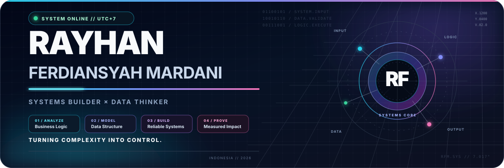
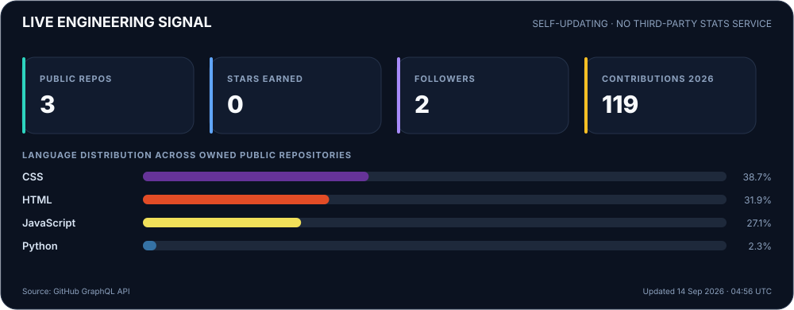

<div align="center">
  
</div>

<br />

<div align="center">
  
  
</div>
.

- **Systems:** requirements, business flow, RBAC, ERD/LRS, and process improvement
- **Data:** relational modeling, SQL, reporting, validation, and decision-ready information
- **Engineering:** Laravel, PHP, MySQL, JavaScript, HTML/CSS, Linux, and Git
- **Delivery:** scope, documentation, testing, iteration, and stakeholder alignment

## Live engineering signal

<div align="center">
  
</div>

<div align="right">
  <sub>Dashboard generated from GitHub data · refreshed automatically</sub>
</div>

## Core toolchain

<div align="center">
  
  
  
  
  
  
  
  
</div>

## Current trajectory

```text
Now      → turning working prototypes into documented, testable case studies
Next     → deeper SQL, database performance, system architecture, and analytics
Long run → engineering systems that make complex organizations easier to operate
```

<div align="center">
  <h3>Build systems that reduce confusion and increase control.</h3>
  <a href="https://github.com/rayhanferdiansyah1-alt/rayhanferdiansyah1-alt/issues/new">Start a technical conversation</a>
  &nbsp;·&nbsp;
  <a href="https://github.com/rayhanferdiansyah1-alt/Portofolio">Explore my portfolio</a>
  <br /><br />
  
</div>
